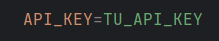
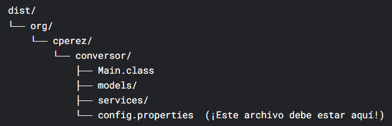
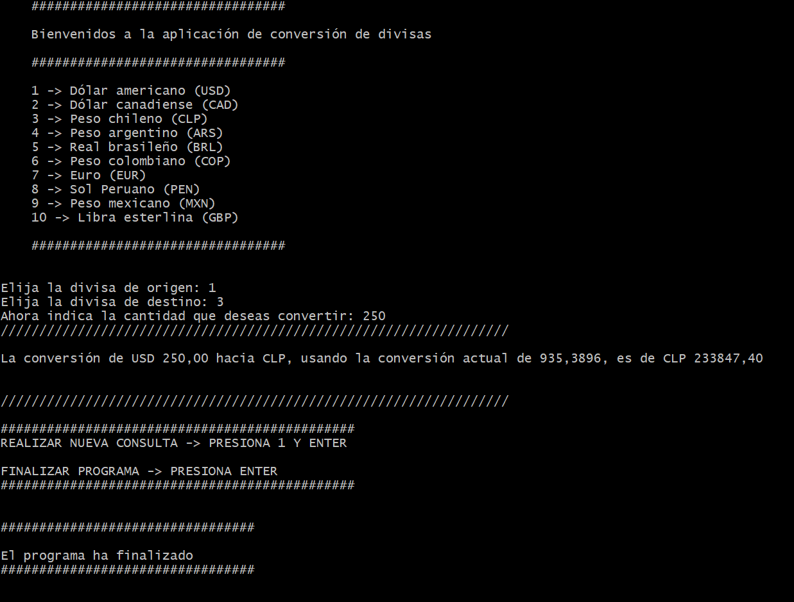

# CONVERSOR DE DIVISAS

<p align="center">Aplicación de consola hecha con Java, la biblioteca <a href="https://github.com/google/gson" target="_blank">GSON</a> y la API  <a href="https://www.exchangerate-api.com/" target="_blank">ExchangeRate-API.</a> </p>

## Descripción

El conversor de divisas es una aplicación que se ejecuta en la consola, cuya función es obtener la conversión desde una divisa de origen a una divisa de destino. El usuario elige entre un conjunto de divisas y luego debe ingresar el monto de la divisa de origen para que la aplicación muestre el resultado de la conversión.

## Cómo utilizar

1. Antes de usar la aplicación, debe contar con una **API KEY** ( <a href="https://www.exchangerate-api.com/" target="_blank">ExchangeRate-API.</a>)

2. Descarga la biblioteca GSON ( <a href="https://mvnrepository.com/artifact/com.google.code.gson/gson/" target="_blank">GSON.</a> Descargar el archivo JAR).

3. Clonar el repositorio

```bash
$ git clone https://github.com/Cr1sti4n85/conversor_divisas.git
```

4. Abra el proyecto en un IDE que soporte Java (Intellij, VS Code, entre otros).

5. Crea un directorio en la raíz del proyecto para almacenar la biblioteca GSON (Por ej. directorio _lib_)

6. Añade la biblioteca GSON a tu proyecto (Este proceso dependerá de cada editor).

7. Busca el archivo _config.properties_ dentro del directorio _conversor_ y reemplaza el texto _TU_API_KEY_ con tu propia clave de la API:



8. Ejecuta la aplicación por medio de la clase **Main**.

## Compilar para ejecutar en terminal

Si quieres ejecutarlo en tu terminal sin usar un editor de código, debes compilarlo para luego ejecutarlo. Antes de hacerlo, debes tener descargada la biblioteca GSON y tener tu clave de la API.

### Pasos

1. Abre una terminal (bash, powershell, etc) y navega hasta el directorio raíz del proyecto (_desafio_conversor_divisas_)

2. Crea un directorio para guardar los archivos compilados (nómbralo como _out_ o _dist_).

3. Ejecuta el comando para compilar. En el siguiente ejemplo, _lib/gson-<version_gson>.jar_ hace referencia a la ruta donde almacenaste la biblioteca (en este caso el directorio _lib_ creado en la raíz del proyecto); _dist_ hace referencia al nombre del directorio donde se guardarán los archivos compilados (el que se creó en el paso 2):

```bash
$ javac -cp "lib/gson-<version_gson>.jar" -d dist src/org/cperez/conversor/*.java src/org/cperez/conversor/models/*.java src/org/cperez/conversor/services/*.java

```

4. Copia el archivo _config.properties_ (con el valor de la API*KEY incluida) dentro del directorio con los archivos compilados. Debe quedar dentro del directorio \_conversor*.



5. Posicionado en el directorio raíz (_desafio_conversor_divisas_), ejecute el siguiente comando para iniciar la aplicación por consola. Reemplaza _dist_ por el nombre de tu directorio de compilación y _lib/gson-<version_gson>.jar_ por el nombre del directorio donde se almacena tu biblioteca GSON.

En Windows:

```
$ java -cp "dist;lib/gson-<version_gson>.jar" org.cperez.conversor.Main

```

En Linux:

```
$ java -cp "dist:lib/gson-<version_gson>.jar" org.cperez.conversor.Main

```

## Imagen de la aplicación


